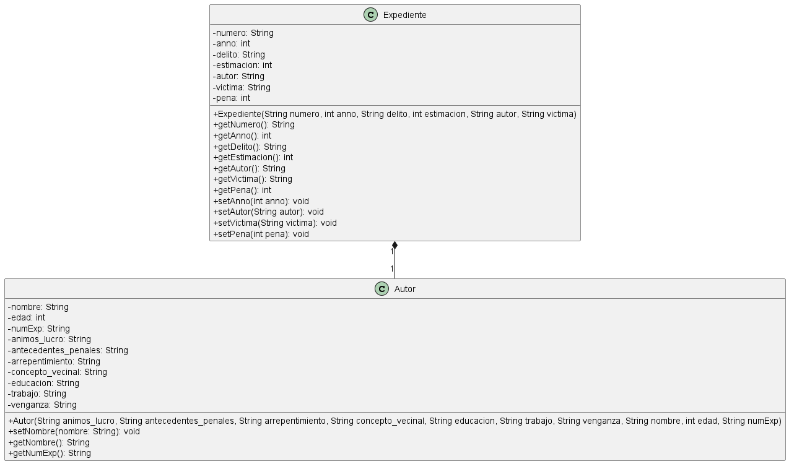

# LEGAL ADVISOR

## Iniciar el proyecto
- Ejecutar el GUI_JUZGADO.java

## Expediente y Autor Livan Hernandez

### Expediente

La clase Expediente es una clase en Java que implementa la interfaz Serializable. Esto significa que los objetos de esta clase pueden ser convertidos a un formato que puede ser almacenado o transmitido y luego reconstruido más tarde. Aquí está lo que hace cada parte:

La clase tiene varios campos privados: numero, anno, delito, estimacion, autor, victima, y pena. Estos campos representan diferentes atributos de un expediente.

El método setPena(int pena) es un método setter que establece el valor del campo pena.

El constructor Expediente(String numero, int anno, String delito, int estimacion, String autor, String victima) inicializa un objeto de la clase Expediente con los valores proporcionados.

Los métodos getNumero(), getAnno(), getDelito(), getEstimacion(), getAutor(), getVictima(), y getPena() son métodos getter que devuelven los valores de los campos correspondientes.

Los métodos setAnno(int anno), setAutor(String autor), y setVictima(String victima) son métodos setter que establecen los valores de los campos anno, autor, y victima respectivamente.

### Autor

La clase Autor es una clase en Java que implementa la interfaz Serializable de la misma manera que la clase anterior Expediente. Aquí está lo que hace cada parte:

La clase tiene varios campos privados que representan diferentes atributos de un autor, como nombre, edad, numExp, animos_lucro, antecedentes_penales, arrepentimiento, concepto_vecinal, educacion, trabajo, y venganza.

El constructor Autor(String animos_lucro, String antecedentes_penales, String arrepentimiento, String concepto_vecinal, String educacion, String trabajo, String venganza, String nombre, int edad, String numExp) inicializa un objeto de la clase Autor con los valores proporcionados.

El método setNombre(String nombre) es un método setter que establece el valor del campo nombre.

Los métodos getNombre() y getNumExp() son métodos getter que devuelven los valores de los campos nombre y numExp respectivamente.
